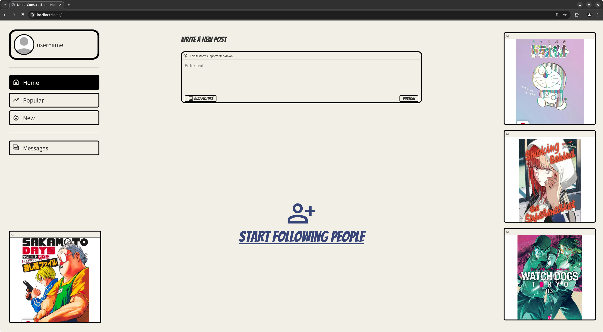
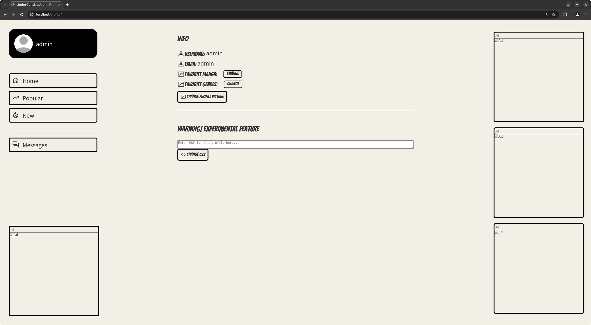
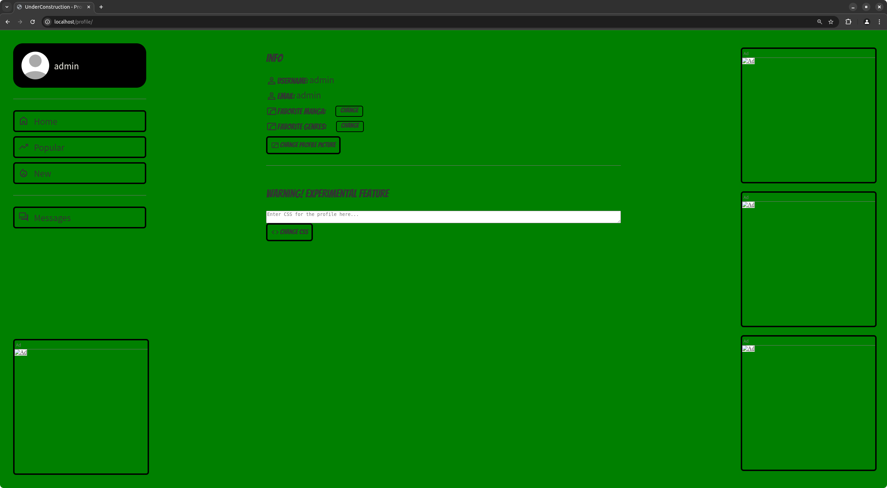

<h1 align="center">UnderConstruction</h1>
<h4 align="center">Web challenge for the K!nd4SUS CTF 2025</h4>

## About

UnderConstruction is a manga-style vulnerable social network used as a web challenge for the K!nd4SUS CTF 2025. It features very simple "home", "popular posts" and "new posts" pages, along with real-time chatting with other users.

## Hosting
```bash
git clone https://github.com/sniirful/UnderConstruction.git
docker compose up
```

## Writeup
Challenge description:
> I am building a manga-inspired social network and the back-end works perfectly fine! The front-end though... I am not that great at it, but at least I think it looks okay.
> 
> Can you check it and see if you’d like to see any other features?

You can find the writeup [here](WRITEUP.md).

## Vulnerabilities
UnderConstruction has two major issues, the first of which is used to get the flag for this challenge, while the second is related to [K!nd4ASSISTANT](https://github.com/sniirful/K1nd4ASSISTANT):
1. If we take a look inside [backend/db.py](backend/db.py), in the first few lines of code we can see this function:
   ```py
   def escape_string(s: str) -> str:
       if s is None:
           return "NULL"
       return "'" + str(s).replace("\\", "\\\\").replace("'", "\\'") + "'"
   ```
   Checking further down the file, we see that it's used to escape variables inside (almost) every SQL query, instead of using parameterized queries.

   This leads to a single parameter not being escaped despite needing it, at lines [192-216](backend/db.py#L192-L216):
   ```py
   def get_posts_new(user_id: int, filter_genres: list[str]) -> list[dict]:
       return select_all(
           f"""
               SELECT
                   p.id,
                   p.user_id,
                   u.username,
                   u.profile_picture,
                   (EXISTS (SELECT 1 FROM follows WHERE user_id = {user_id} AND following_id = p.user_id)) as following,
                   p.posted,
                   p.text,
                   (EXISTS (SELECT 1 FROM likes WHERE user_id = {user_id} AND post_id = p.id)) as liked,
                   (SELECT COUNT(1) FROM likes WHERE post_id = p.id) as like_count
               FROM
                   posts p
               JOIN
                   users u ON p.user_id = u.id
               WHERE
                   false
               {"".join([f" OR u.fav_genres LIKE '%{genre}%'" for genre in filter_genres]) if filter_genres else "OR true"}
               ORDER BY
                   p.posted DESC
               LIMIT 50
           """
       )
   ```
   The issue with it is that the genres inside `filter_genres` are strings, thus potentially malicious. Taking a look into where this function is invoked ([backend/app.py:238-261](backend/app.py#L238-L261)), we see why it's a problem:
   ```py
   @app.route('/api/posts/new', methods=['GET'])
   def get_posts_new():
       user = users.get_user_flask(flask.request)
       if not user:
           return responses.unauthorized()
   
       filter_genres = flask.request.args.get('genres')
       posts = db.get_posts_new(user['id'], filter_genres.split(',') if filter_genres else [])
       return flask.jsonify({
           "status": "OK",
           "data": [{
               "id": post['id'],
               "poster": {
                   "id": post['user_id'],
                   "username": post['username'],
                   "following": bool(post['following']),
                   "profile_picture": post['profile_picture'],
               },
               "posted": post['posted'],
               "text": post['text'],
               "liked": bool(post['liked']),
               "likes": post['like_count'],
           } for post in posts]
       })
   ```
   The function `get_posts_new` doesn't sanitize the request args before passing them into the db function, thus allowing SQL injections.
2. The second vulnerability can only be exploited if the user is an admin, thus only if he has the admin cookie from [docker-compose.yaml](docker-compose.yaml). In the /profile page, an admin can see an "experimental feature":
   
   The "feature" is a textbox that allows the user to change the style of a profile using CSS directly. If we want to see a profile with completely green background, we can do so:
   ```css
   body {
       background-color: green;
   }
   ```
   
   Taking a look at the code that handles this ([frontend/js/profile.js:123-131](frontend/js/profile.js#L123-L131)), we see that it makes use of a custom function:
   ```js
   if (profile.css) {
       // Will not escape it or else the CSS will get escaped too...
       let {newStyle} = elements.create(`
           <style b-name="newStyle">
               ${profile.css}
           </style>
       `);
       document.head.appendChild(newStyle);
   }
   ```
   This `elements.create` is located into [frontend/js/utils.js](frontend/js/utils.js):
   ```js
   const elements = {
       escape: (text) => {
           let container = document.createElement('div');
           container.innerText = text;
           return container.innerHTML;
       },
   
       create: (html, ...escapedParams) => {
           let escapedHTML = '';
           let escapedParamsCounter = 0;
           for (let i = 0; i < html.length; i++) {
               let character = html[i];
               let nextCharacter = (i < html.length - 1) ? (html[i + 1]) : ('');
               if (character === '\\' && nextCharacter === '?') {
                   escapedHTML += '\\';
                   i++;
                   continue;
               } else if (character === '?') {
                   escapedHTML += elements.escape(escapedParams[escapedParamsCounter++]);
                   continue;
               }
               escapedHTML += character;
           }
   
           let container = document.createElement('div');
           container.getAttribute('b-name')
           container.innerHTML = escapedHTML;
   
           let res = {};
           elements.iterateChildren(container.childNodes, child => {
               if (!child.getAttribute) return;
   
               let bName = child.getAttribute('b-name');
               if (bName) {
                   child.removeAttribute('b-name');
                   res[bName] = child;
               }
           });
   
           return res;
       },
   
       iterateChildren: (children, callback) => {
           for (let child of children) {
               callback(child);
               if (child.childNodes && child.childNodes.length > 0) {
                   elements.iterateChildren(child.childNodes, callback);
               }
           }
       }
   };
   ```
   It creates elements from an HTML string, and returns the ones that have a `b-name` attribute. This means that this code:
   ```js
   let {a, b} = elements.create(`
       <h1 b-name="a">
           <h2 b-name="b">
               Hello!
           </h2>
       </h1>
   `);
   ```
   returns `a`, the `<h1>`, and `b`, the `<h2>` containing `Hello!`. In case we want to safely add some potentially malicious string inside the HTML, we can do so by using the `escapedParams` parameter in `elements.create`:
   ```js
   let {a} = elements.create(`
       <span b-name="a">
           ?
       </span>
   `, '<script>alert(1)</script>');
   ```
   This code returns the `<span>` containing the text `<script>alert(1)</script>`, without treating it as HTML.

   The issue with `elements.create` lies in the code that iterates children, lines 30-38, which doesn't check whether a certain element exists already or not. In this case, that is coupled with the CSS being injected directly instead of making use of `escapedParams`, therefore allowing us to exploit the code with the following "CSS":
   ```html
   </style>
   ```
   This payload inserts the `` tag into the HTML instead of the `<style>` tag.

## Info
The pictures and links used for the ads were not intended as real ads, nor were they intended to steal content from independent sellers. For problems of any kind, including copyright-related, feel free to open an issue and they will be taken care of.